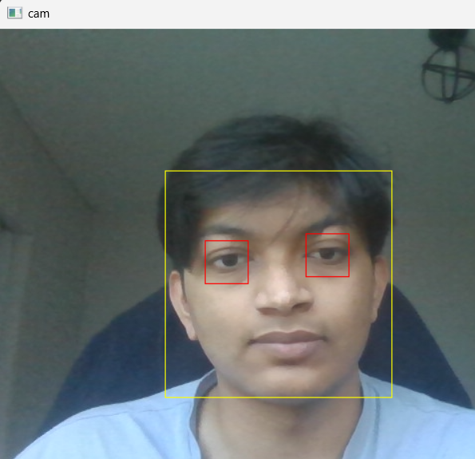

# Real-Time Face and Eye Detection using OpenCV

This project demonstrates real-time face and eye detection using OpenCV's Haar Cascades. It captures live video feed from your webcam, detects faces and eyes, and draws bounding boxes around them.

## Features
- **Face Detection:** Detects faces in real-time using Haar Cascades.
- **Eye Detection:** Detects eyes within the detected faces.
- **Webcam Integration:** Captures live video from your webcam.
- **Bounding Boxes:** Draws bounding boxes around detected faces and eyes.



## How to Use
1. Clone this repository:
    ```bash
    git clone https://github.com/yourusername/face-eye-detection.git
    ```

2. Install the required dependencies:
    ```bash
    pip install -r requirements.txt
    ```

3. Run the application:
    ```bash
    python main.py
    ```

4. To stop the application, press `q`.

## Project Dependencies
- Python 3.9+
- [OpenCV](https://opencv.org/)
- [Matplotlib](https://matplotlib.org/)
